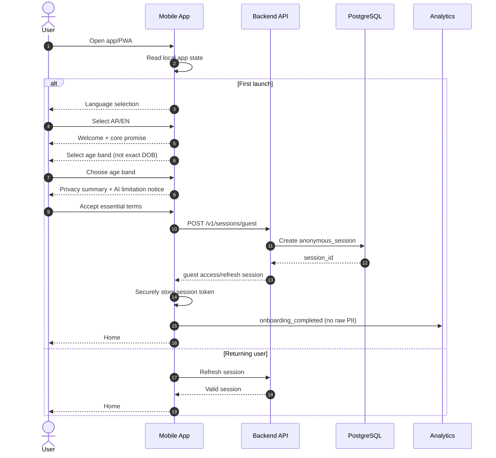
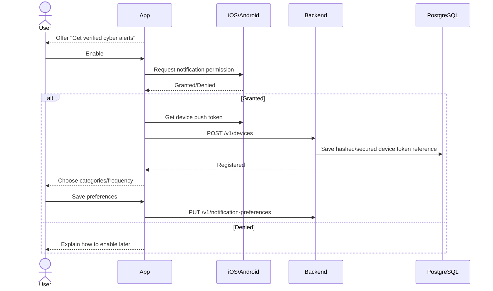
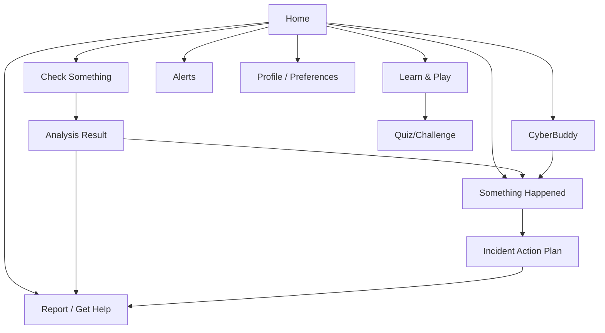
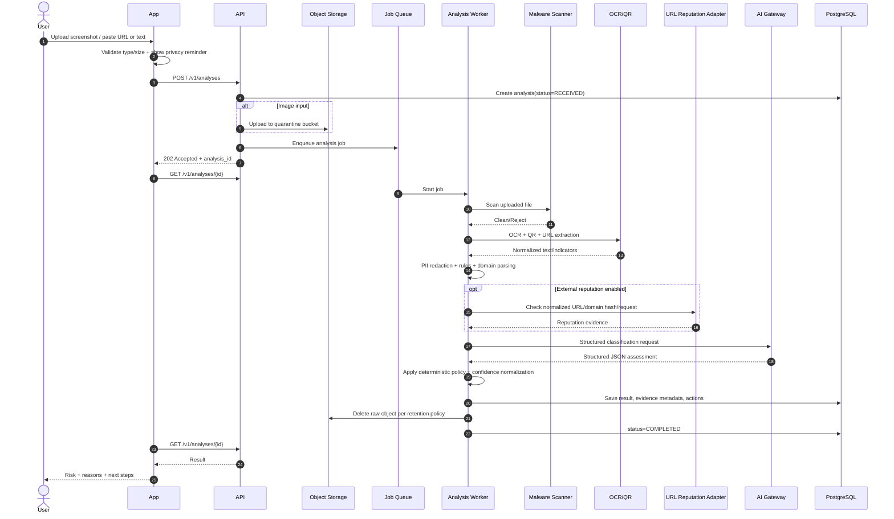
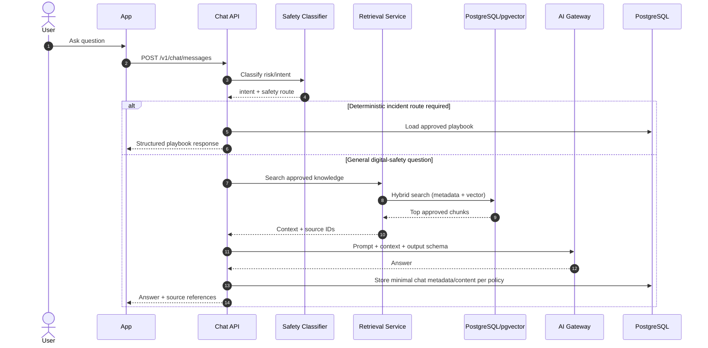
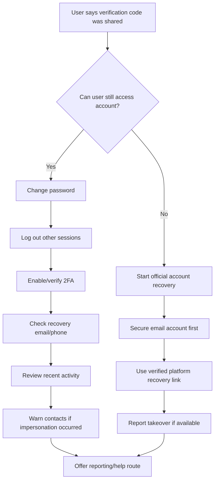
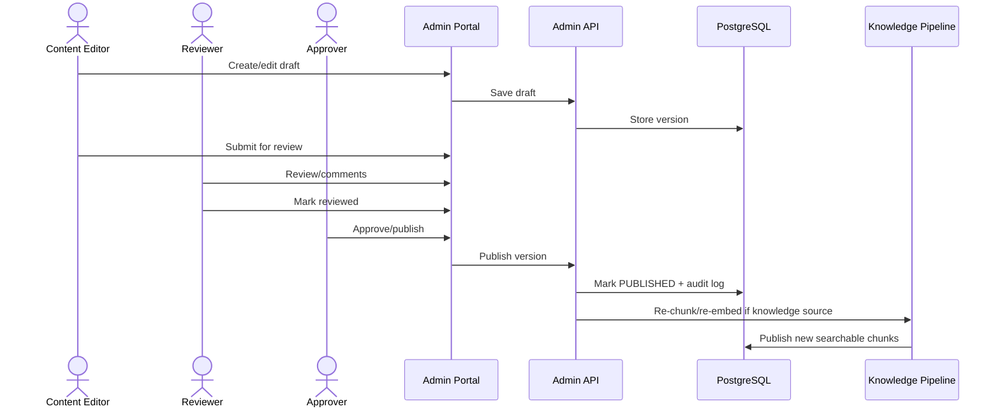
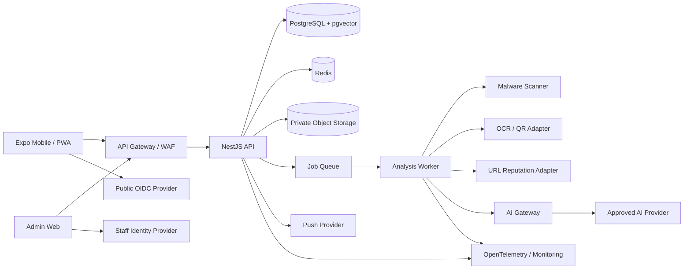
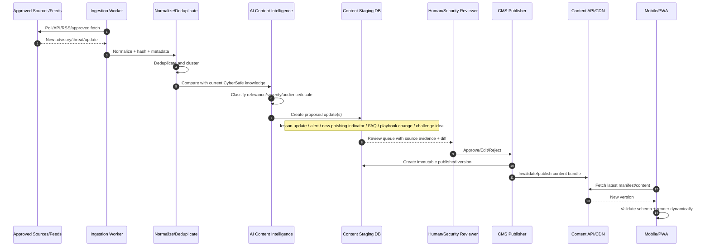

# CyberSafe Lebanon
## Software Requirements Specification (SRS) and Technical Design
**Version:** 1.0
**Status:** Reference implementation / development baseline
**Audience:** Product owner, software engineers, UX/UI, cybersecurity, DevSecOps, AI engineers, QA, safeguarding, legal/privacy reviewers, and Codex/AI coding agents.

> **Purpose:** This document converts the CyberSafe Lebanon concept into an implementation-ready specification. It intentionally separates **business requirements**, **functional requirements**, **non-functional requirements**, **technical requirements**, **data model**, **API design**, **security**, **AI architecture**, **user/page flows**, **sequence flows**, **deployment**, **testing**, and **acceptance criteria**.

---

# 1. Executive technical summary

CyberSafe Lebanon is a mobile-first digital safety platform for adolescents and young adults. It should provide:

1. **Guest-first access** for low-friction, privacy-preserving use.
2. Optional **account registration/login** for saved progress, badges, preferences, notifications, and cross-device continuity.
3. **Check Something**: AI-assisted analysis of suspicious screenshots, messages, links, QR codes, emails, SMS, and social-media DMs.
4. **CyberBuddy**: retrieval-grounded digital safety assistant.
5. **Something Happened**: deterministic incident-response playbooks.
6. **Report / Get Help**: verified routing to platform or national support/reporting channels.
7. **Learn & Play**: micro-lessons, quizzes, scenarios, badges, and challenges.
8. **Verified Alerts**: approved scam/cyber-risk notices.
9. **Content/admin console** for curated resources and emergency playbooks.
10. **Privacy-preserving analytics**.

The app is **not** an antivirus, endpoint protection tool, threat intelligence product, law-enforcement database, or guaranteed phishing detector.

---

# 2. Recommended reference technology stack

The reference implementation uses a TypeScript-first stack so one engineering team and Codex can work across mobile, web, API, background workers, validation schemas, tests, and shared types.

| Layer | Recommended technology | Notes |
|---|---|---|
| Mobile app | React Native + Expo + Expo Router | Android + iOS; can also provide web/PWA route |
| Language | TypeScript | Strict mode enabled |
| State/data fetching | TanStack Query + Zustand | Query for server state; Zustand for small local UI/session state |
| Forms/validation | React Hook Form + Zod | Shared validation contracts where practical |
| Backend API | NestJS + TypeScript | Modular monolith for MVP; clean boundaries allow later service extraction |
| API style | REST JSON + OpenAPI 3.1 | SSE/WebSocket only for streaming chat if desired |
| Database | PostgreSQL 16+ | Main system of record |
| Vector retrieval | pgvector | Store approved content embeddings in PostgreSQL |
| Cache/rate limiting | Redis 7+ | Sessions/rate limit/cache/job coordination |
| Background jobs | BullMQ + Redis | Screenshot processing, OCR, URL reputation checks, embeddings, notifications |
| File/object storage | S3-compatible object storage | Azure Blob / AWS S3 / MinIO mapping possible |
| Auth | OIDC/OAuth2 compatible provider + app-issued session | Guest mode supported; avoid custom password auth if possible |
| Device token storage | Expo SecureStore | Access/refresh token material only; never AsyncStorage for secrets |
| Notifications | Expo Notifications / FCM / APNs | Explicit opt-in |
| Observability | OpenTelemetry + structured JSON logs | Export to Azure Monitor, Grafana, Datadog, etc. |
| Error tracking | Sentry-compatible SDK | Must scrub PII |
| AI orchestration | Provider abstraction in backend | Never call foundation model directly from mobile client |
| OCR / vision | Pluggable provider | Local/server OCR or approved cloud service |
| Malware scanning | ClamAV or managed scanning service | Scan uploaded files before downstream processing |
| CI/CD | GitHub Actions | Lint, tests, SAST, dependency scan, build, deploy |
| Containers | Docker | Backend, worker, admin, local dependencies |
| Infrastructure as Code | Terraform or Bicep | Choose per hosting environment |
| Admin portal | Next.js + TypeScript | Restricted RBAC; separate from public mobile UI |

### Cloud-neutral deployment mapping
- **Azure:** Container Apps / AKS; Azure Database for PostgreSQL; Azure Cache for Redis; Blob Storage; Key Vault; Front Door/WAF; Application Insights.
- **AWS:** ECS/EKS; RDS PostgreSQL; ElastiCache Redis; S3; Secrets Manager; CloudFront/WAF; CloudWatch.
- **On-prem/private cloud:** Kubernetes; PostgreSQL; Redis; MinIO; Vault; ingress/WAF.

---

# 3. Architectural principles

1. **Guest-first:** no registration is required for safety information, incident guidance, or one-off checks.
2. **Privacy by default:** do not retain uploaded screenshots unless explicitly required by an approved workflow.
3. **Deterministic before generative:** recovery playbooks and high-risk actions come from approved rules/content, not free-form AI.
4. **AI is assistive, never authoritative:** use confidence and uncertainty wording.
5. **Server-side AI only:** API keys, prompts, moderation rules, reputation providers, and model orchestration live in backend services.
6. **Modular monolith first:** one deployable backend plus worker is easier to secure and operate for MVP; keep domain modules isolated.
7. **Content is versioned:** every answer source, lesson, playbook, and reporting route has owner, effective date, review date, locale, and publication status.
8. **Security verification is a release gate.**
9. **Minimal youth profiling:** avoid collecting exact DOB, school, precise location, or unnecessary demographic data.
10. **Human escalation is explicit:** certain cases require verified support or reporting pathways.

---

# 4. Business requirements (BR)

## BR-001 Year-round continuity
CyberSafe Lebanon shall extend Cybersecurity Awareness Week into a year-round digital safety service.

**Success criteria**
- Users can access the platform outside campaign dates.
- Content administrators can publish/update resources without a new app release.
- The system supports recurring learning challenges and verified alerts.

## BR-002 Practical digital protection
The product shall help young people recognize suspicious digital interactions and take safer next actions.

## BR-003 Accessible support
The product shall provide simple guidance in at least Arabic and English; French should be supported as a configurable third locale.

## BR-004 Low-friction access
Core safety functionality shall be usable without account registration.

## BR-005 Trusted knowledge
Advice shall be based on approved, version-controlled resources.

## BR-006 Responsible AI
AI functions shall be designed to communicate uncertainty, avoid false guarantees, and protect submitted personal data.

## BR-007 Safe incident response
Users experiencing account compromise, phishing, scams, impersonation, harassment, or related digital risks shall receive prioritized recovery steps.

## BR-008 Reporting routing
The product shall route users to verified reporting/help channels. Direct case intake is out of scope unless approved governance, legal basis, safeguarding, and operational ownership are established.

## BR-009 Learning and engagement
The platform shall reinforce practical cybersecurity behaviours through micro-learning, challenges, quizzes, and optional badges.

## BR-010 Evidence for programme improvement
The product shall provide aggregated analytics on usage, learning, and emerging themes while minimizing personal data.

## BR-011 Scalable national architecture
The system shall support expansion to multiple institutions, campaigns, partners, and content owners.

## BR-012 Institutional governance
The system shall support clear roles for platform owner, content approver, cybersecurity reviewer, safeguarding reviewer, administrator, analyst, and help-pathway owner.

---

# 5. User roles

| Role | Description | Authentication |
|---|---|---|
| Guest | Anonymous public user | Anonymous session |
| Registered user | Optional account to save history/progress/preferences | OIDC / magic link / approved provider |
| Youth participant | Same as registered user; may join campaigns/challenges | Account optional depending challenge |
| Parent/educator | Uses resources and guidance | Guest/account |
| Content editor | Creates draft lessons/resources/alerts | Staff SSO + MFA |
| Content approver | Publishes content | Staff SSO + MFA |
| Security reviewer | Approves security-related playbooks/alerts | Staff SSO + MFA |
| Safeguarding reviewer | Approves sensitive guidance and escalation paths | Staff SSO + MFA |
| Analyst | Reads aggregated dashboards | Staff SSO + MFA |
| System administrator | Technical administration | Staff SSO + MFA; least privilege |
| Support/reporting owner | Maintains verified reporting channels | Staff SSO + MFA |

---

# 6. Scope

## 6.1 MVP in scope
- First-launch onboarding
- Language selection
- Guest session
- Optional account registration/login/logout
- Home dashboard
- Check Something:
  - pasted text
  - URL
  - screenshot/image
  - QR extraction from image
- Risk assessment result with reasons and next steps
- CyberBuddy text chat
- Retrieval from approved knowledge base
- Incident-response playbooks
- Learn/resource library
- Quiz/challenge engine
- User progress for registered users
- Local progress for guests
- Notification opt-in and categories
- Verified alerts
- Reporting/help directory
- Admin content management
- Audit log for administrative changes
- Privacy-preserving analytics
- English/Arabic localization
- Security controls and DevSecOps baseline

## 6.2 Post-MVP
- Native share-sheet extension: "Share to CyberSafe"
- QR camera scanner
- Email forwarding address / browser extension
- Institution-level campaigns and team challenges
- French localization
- Native certificate generation
- Moderated community questions
- Deep threat-intelligence enrichment
- Native Android/iOS widgets
- Optional direct reporting integration
- Advanced parent/educator dashboards
- Offline content packs
- Passkeys

## 6.3 Explicitly out of scope for MVP
- Antivirus/EDR
- Device cleanup
- Automatic account recovery on third-party services
- Law-enforcement case management
- Storage of intimate images
- Facial recognition
- Exact geolocation tracking
- Continuous reading of messages/email
- Background monitoring of device content
- Guaranteed detection of phishing or AI-generated media
- Financial transaction reversal
- Hidden surveillance or parental monitoring

---

# 7. Navigation and page inventory

## Public/mobile pages
1. Splash
2. Language selection
3. Welcome / value proposition
4. Age-band & safety notice
5. Privacy summary / consent
6. Continue as Guest
7. Sign up / Log in
8. Notification preference prompt (deferred)
9. Home
10. Check Something
11. Upload Preview / Redaction Confirmation
12. Analysis Processing
13. Analysis Result
14. Result Detail: Why
15. Result Detail: What To Do
16. CyberBuddy
17. CyberBuddy Conversation
18. Something Happened
19. Incident Type
20. Incident Triage Questions
21. Incident Action Plan
22. Report / Get Help
23. Reporting Route Detail
24. Learn
25. Topic Detail
26. Lesson
27. Quiz
28. Challenge
29. Challenge Result
30. Alerts
31. Alert Detail
32. Saved / History
33. Progress / Badges
34. Profile
35. Preferences
36. Language
37. Notifications
38. Privacy & Data Controls
39. Delete Account
40. About / Disclaimer
41. Help / FAQ
42. Offline / Error / Maintenance screens

## Admin pages
1. Staff login
2. Dashboard
3. Content list
4. Content editor
5. Content review workflow
6. Knowledge source library
7. Incident playbook editor
8. Reporting routes
9. Alerts
10. Challenges
11. Translations
12. Analytics
13. Audit log
14. User support controls (minimal)
15. Feature flags
16. System health

---

# 8. First-launch and subscription/onboarding flow

## 8.1 First launch sequence


## 8.2 Account creation
Account creation must be optional and should be offered when the user wants cross-device history, badges, saved progress, or notifications.

```mermaid
sequenceDiagram
    autonumber
    actor U as User
    participant A as App
    participant IDP as Identity Provider
    participant API as Backend
    participant DB as PostgreSQL

    U->>A: Tap "Create account"
    A-->>U: Explain benefits + data use
    U->>A: Choose sign-in method
    A->>IDP: OIDC Authorization Code + PKCE
    IDP-->>A: Authorization callback
    A->>API: Exchange/validate identity assertion
    API->>IDP: Verify token/JWKS
    API->>DB: Find or create user
    API->>DB: Link guest session history if user consents
    API-->>A: App access token + refresh token
    A->>A: Store token in SecureStore
    A-->>U: Account created; return to previous context
```

## 8.3 Notification subscription
Do not request push permission during first app launch. Ask contextually after the user sees value.



---

# 9. Home page requirements

## FR-HOME-001
Home shall display the following primary actions:
- Check Something
- Ask CyberBuddy
- Something Happened
- Learn & Play
- Report / Get Help

## FR-HOME-002
Home may display:
- current verified alert
- weekly challenge
- saved progress
- recent analysis shortcut
- emergency help shortcut

## FR-HOME-003
Guest and registered experiences shall be almost identical. Features requiring persistence shall prompt account creation only when needed.

## FR-HOME-004
Home shall not display fear-based threat counters or manipulative urgency.

### Home navigation


---

# 10. Check Something - functional requirements

## Supported input types
- Plain text
- URL
- Screenshot/image: JPG, JPEG, PNG, WEBP
- QR code embedded in uploaded image
- Optional post-MVP: PDF/email file formats

## FR-SCAN-001 Input
The user shall be able to paste text or URL and upload/take a screenshot.

## FR-SCAN-002 Privacy warning
Before upload, the UI shall instruct the user not to upload:
- passwords
- one-time codes
- identity documents
- banking credentials
- intimate images
- unnecessary personal information

## FR-SCAN-003 Client validation
The app shall validate file type and file size before upload.

Recommended MVP limit: **10 MB** per image.

## FR-SCAN-004 Server validation
The backend shall:
- verify actual MIME signature
- reject executable/polyglot formats
- sanitize image metadata
- malware-scan file
- generate a server-side random object key
- never trust original filename

## FR-SCAN-005 Redaction
The processing pipeline should identify likely:
- email addresses
- phone numbers
- account numbers
- names where technically feasible
- URLs/query parameters containing tokens
and redact them from content sent to external AI providers when practical.

## FR-SCAN-006 Analysis
The system shall combine multiple signals rather than relying only on an LLM:
1. input normalization
2. OCR
3. URL extraction
4. QR extraction
5. lexical/rule-based phishing indicators
6. optional URL reputation provider
7. domain parsing
8. approved organization/domain matching
9. AI classification/explanation
10. deterministic safety rules
11. confidence normalization

## FR-SCAN-007 Risk levels
Use:
- `LOW_CONCERN`
- `CAUTION`
- `HIGH_RISK`
- `INSUFFICIENT_INFORMATION`

Never use `SAFE` as an absolute state.

## FR-SCAN-008 Result structure
Result shall contain:
- risk level
- confidence band (low/medium/high; not false precision)
- 1–5 reasons
- extracted suspicious indicators
- recommended next actions
- "What if I already clicked/shared?" CTA
- report/help CTA where relevant
- AI limitation statement
- analysis timestamp
- optional evidence/provider status
- feedback: Helpful / Not helpful / I think this is wrong

## FR-SCAN-009 No automatic execution
The system shall never open a submitted URL automatically during user-facing analysis.

## FR-SCAN-010 Link handling
Any server-side URL inspection must use isolated network controls and block SSRF targets:
- loopback
- RFC1918/private addresses
- link-local
- cloud metadata endpoints
- internal DNS names
- non-HTTP(S) schemes

## FR-SCAN-011 Retention
Default uploaded-file retention target: **ephemeral processing only**; delete raw upload after processing unless a documented alternative is approved.

## Scan sequence


---

# 11. Analysis engine technical design

## 11.1 Pipeline stages
### Stage A - ingestion
Input is converted to `AnalysisInput`.

```ts
type AnalysisInput =
  | { type: "TEXT"; text: string }
  | { type: "URL"; url: string }
  | { type: "IMAGE"; objectKey: string; mimeType: string };
```

### Stage B - extraction
Create normalized evidence:
```ts
interface ExtractedEvidence {
  text: string;
  urls: string[];
  qrValues: string[];
  emails: string[];
  phones: string[];
  domains: string[];
  language?: "ar" | "en" | "fr" | "other";
  ocrConfidence?: number;
}
```

### Stage C - deterministic indicators
Examples:
- urgency / threat language
- request for password/OTP
- mismatch between displayed and actual link
- URL shortener
- punycode / confusable domains
- IP-literal URL
- excessive subdomains
- suspicious TLD heuristic
- known approved domain mismatch
- login/payment request
- remote-access software request
- gift card / crypto / transfer demand
- impersonation cues

Rules must be versioned and individually testable.

### Stage D - external reputation
Use an adapter interface:
```ts
interface ReputationProvider {
  checkUrl(url: string): Promise<ReputationResult>;
  checkDomain(domain: string): Promise<ReputationResult>;
}
```
The project can run without an external provider.

### Stage E - AI structured assessment
The model receives:
- redacted text/evidence
- deterministic signals
- reputation evidence
- risk rubric
- allowed output JSON schema
- instruction not to claim certainty

The model must return JSON validated by Zod.

### Stage F - policy combiner
The final risk is produced by application policy, not by accepting model output blindly.

Example:
- known malicious reputation => `HIGH_RISK`
- OTP/password request + impersonation => at least `HIGH_RISK`
- no extractable evidence => `INSUFFICIENT_INFORMATION`
- AI says safe but deterministic high-risk signal exists => override upward
- model parsing failure => fallback to deterministic result

---

# 12. CyberBuddy - functional and technical requirements

## FR-CHAT-001
User can start a conversation as guest or registered user.

## FR-CHAT-002
The assistant shall support Arabic and English at MVP.

## FR-CHAT-003
The assistant shall retrieve from approved published knowledge before generating a response.

## FR-CHAT-004
Answers shall cite/display source title(s) or "Based on CyberSafe guidance" links where practical.

## FR-CHAT-005
The assistant shall recognize high-risk intents such as:
- account compromise
- blackmail/extortion
- financial scam
- threat of violence
- sexual exploitation / intimate-image concern
- child protection concern
and route to deterministic playbooks/escalation guidance.

## FR-CHAT-006
Conversation memory shall be scoped to the current chat. Long-term memory about sensitive incidents is disabled by default.

## FR-CHAT-007
The user can delete individual chats or all chat history.

## FR-CHAT-008
The assistant shall reject requests to use the app to hack, stalk, phish, steal credentials, bypass security, or harm others; it may redirect to defensive education.

## RAG sequence


---

# 13. Something Happened - incident playbooks

## Initial incident types
1. Account hacked/taken over
2. Clicked suspicious link
3. Shared password
4. Shared verification/OTP code
5. Device lost/stolen
6. Fake profile / impersonation
7. Cyberbullying/harassment
8. Blackmail/extortion
9. Lost money to scam
10. Suspicious app installed
11. Social account locked
12. AI/deepfake impersonation

## FR-INC-001
The system shall use approved decision trees, not free-form model generation, for core recovery actions.

## FR-INC-002
A playbook step can contain:
- title
- instruction
- priority
- link
- platform-specific variant
- "done" checkbox
- reason
- escalation condition
- warning
- optional timer/reminder

## FR-INC-003
Playbooks shall be versioned and auditable.

## Example decision flow - shared verification code


---

# 14. Report / Get Help requirements

## FR-HELP-001
Reporting routes shall be records in the database, not hard-coded app URLs.

## FR-HELP-002
Each route shall include:
- route ID
- category
- organization/platform
- country/region
- age restrictions
- supported languages
- URL / phone / channel
- open hours if applicable
- description
- owner
- verification date
- review date
- publication status

## FR-HELP-003
External links shall display destination organization before opening.

## FR-HELP-004
The app shall not represent an external organization as endorsing CyberSafe unless authorized.

## FR-HELP-005
Expired/unverified routes shall automatically stop appearing after configurable grace rules.

---

# 15. Learn & Play requirements

## Content types
- article/micro-lesson
- scenario
- quiz
- challenge
- checklist
- video/link
- facilitator card
- glossary entry

## FR-LEARN-001
Lessons must support:
- locale
- estimated duration
- difficulty
- age band
- topic
- learning objective
- content blocks
- quiz link
- source references
- version
- review date

## FR-LEARN-002
Registered users can sync progress. Guest progress stays on-device unless later merged with consent.

## FR-LEARN-003
Challenges can be:
- one-time
- weekly
- campaign-based
- institution-specific
- public national

## FR-LEARN-004
Do not expose public individual-level leaderboard data by default.

## FR-LEARN-005
Quiz attempts should store question version so later edits do not corrupt historical scores.

---

# 16. Alerts requirements

## Alert statuses
`DRAFT -> IN_REVIEW -> APPROVED -> SCHEDULED -> PUBLISHED -> EXPIRED -> ARCHIVED`

## FR-ALERT-001
Only approved staff roles may publish alerts.

## FR-ALERT-002
Alert contains:
- title
- short summary
- risk category
- body
- indicators
- recommended actions
- start/end time
- geography (broad only)
- language variants
- source/owner
- push-notification eligibility

## FR-ALERT-003
Push notifications must not contain sensitive user-specific incident information.

---

# 17. Authentication and session requirements

## Guest sessions
- Backend issues opaque or signed guest session ID.
- No email/phone required.
- Session can be rotated.
- Guest data retention is minimal.
- Guest progress can be stored locally.

## Registered sessions
- Use OAuth2/OIDC Authorization Code + PKCE.
- No embedded webview credential collection.
- Access token short-lived.
- Refresh token rotation.
- Secure device storage.
- Server-side revocation support.
- Staff administration uses separate issuer/audience and mandatory MFA.

## FR-AUTH-001
The app shall never store passwords if an external IdP is used.

## FR-AUTH-002
Tokens shall not be stored in AsyncStorage.

## FR-AUTH-003
Logout shall revoke refresh/session where technically supported and delete local secure tokens.

## FR-AUTH-004
Delete account shall:
- reauthenticate if needed
- show consequences
- create deletion request
- delete/anonymize personal records according to retention policy
- preserve required security/audit records only where legally/operationally justified

---

# 18. Data model overview

```mermaid
erDiagram
    USERS ||--o{ USER_IDENTITIES : has
    USERS ||--o{ DEVICES : owns
    USERS ||--o{ USER_PREFERENCES : has
    USERS ||--o{ ANALYSES : requests
    USERS ||--o{ CONVERSATIONS : starts
    CONVERSATIONS ||--o{ CHAT_MESSAGES : contains
    ANALYSES ||--o{ ANALYSIS_INDICATORS : contains
    ANALYSES ||--o{ ANALYSIS_FEEDBACK : receives
    CONTENT_ITEMS ||--o{ CONTENT_VERSIONS : versions
    CONTENT_ITEMS ||--o{ CONTENT_TRANSLATIONS : translates
    KNOWLEDGE_SOURCES ||--o{ KNOWLEDGE_CHUNKS : chunks
    KNOWLEDGE_CHUNKS ||--o{ CONTENT_SOURCE_LINKS : supports
    CONTENT_ITEMS ||--o{ CONTENT_SOURCE_LINKS : cites
    INCIDENT_PLAYBOOKS ||--o{ INCIDENT_PLAYBOOK_VERSIONS : versions
    INCIDENT_PLAYBOOK_VERSIONS ||--o{ INCIDENT_STEPS : contains
    REPORTING_ROUTES ||--o{ REPORTING_ROUTE_TRANSLATIONS : translates
    CHALLENGES ||--o{ CHALLENGE_TASKS : contains
    USERS ||--o{ USER_CHALLENGE_PROGRESS : completes
    USERS ||--o{ USER_LESSON_PROGRESS : completes
    ALERTS ||--o{ ALERT_TRANSLATIONS : translates
    USERS ||--o{ NOTIFICATION_PREFERENCES : configures
    ADMIN_USERS ||--o{ AUDIT_LOGS : creates
```



---

# 19. Database schema specification

Use PostgreSQL UUID primary keys and UTC `timestamptz`.

## Core identity
### users
- `id uuid pk`
- `status varchar(20)` ACTIVE/LOCKED/DELETION_PENDING/DELETED
- `display_name varchar(80) nullable`
- `age_band varchar(20) nullable`
- `preferred_locale varchar(10)`
- `created_at timestamptz`
- `updated_at timestamptz`
- `deleted_at timestamptz nullable`

Do **not** store exact DOB by default.

### user_identities
- `id uuid pk`
- `user_id uuid fk`
- `provider varchar(40)`
- `provider_subject varchar(255)`
- `email varchar(320) nullable`
- `email_verified boolean`
- `created_at`

Unique `(provider, provider_subject)`.

### anonymous_sessions
- `id uuid pk`
- `public_id uuid unique`
- `locale`
- `age_band nullable`
- `created_at`
- `last_seen_at`
- `expires_at`
- `converted_user_id nullable`

### devices
- `id uuid pk`
- `user_id nullable`
- `anonymous_session_id nullable`
- `platform`
- `push_provider`
- `push_token_ciphertext` or secure token reference
- `app_version`
- `last_seen_at`
- `revoked_at nullable`

## Analysis
### analyses
- `id uuid pk`
- `user_id nullable`
- `anonymous_session_id nullable`
- `input_type`
- `status`
- `risk_level nullable`
- `confidence_band nullable`
- `summary nullable`
- `language nullable`
- `policy_version`
- `ai_model_ref nullable`
- `created_at`
- `completed_at nullable`
- `raw_upload_deleted_at nullable`

### analysis_inputs
Store minimized normalized metadata, not unnecessary raw screenshots.
- `analysis_id uuid pk/fk`
- `normalized_text_redacted text nullable`
- `normalized_url text nullable`
- `object_key_quarantine text nullable`
- `mime_type nullable`
- `byte_size nullable`
- `sha256 nullable`

### analysis_indicators
- `id uuid pk`
- `analysis_id fk`
- `indicator_code`
- `severity`
- `value_redacted nullable`
- `source` RULE/REPUTATION/OCR/QR/AI
- `metadata jsonb`
- `created_at`

### analysis_recommendations
- `id uuid`
- `analysis_id`
- `priority int`
- `action_code`
- `title`
- `body`
- `playbook_id nullable`

### analysis_feedback
- `id uuid`
- `analysis_id`
- `user_id nullable`
- `anonymous_session_id nullable`
- `rating` HELPFUL/NOT_HELPFUL/INCORRECT
- `comment text nullable`
- `created_at`

## Chat
### conversations
- `id uuid`
- `user_id nullable`
- `anonymous_session_id nullable`
- `locale`
- `created_at`
- `deleted_at nullable`

### chat_messages
- `id uuid`
- `conversation_id`
- `role` USER/ASSISTANT/SYSTEM_EVENT
- `content_redacted text`
- `intent_code nullable`
- `safety_route nullable`
- `model_ref nullable`
- `created_at`
- `deleted_at nullable`

### chat_message_sources
- `chat_message_id`
- `knowledge_chunk_id`
- `rank`
- composite PK

## Knowledge/content
### knowledge_sources
- `id uuid`
- `title`
- `source_type`
- `canonical_url nullable`
- `owner`
- `publisher`
- `locale`
- `status`
- `effective_date`
- `review_due_at`
- `content_hash`
- timestamps

### knowledge_chunks
- `id uuid`
- `source_id`
- `chunk_index`
- `text`
- `embedding vector(...)`
- `metadata jsonb`
- `published boolean`

Create vector and metadata indexes.

### content_items
- `id uuid`
- `type`
- `slug unique`
- `topic`
- `status`
- `audience`
- `age_band`
- `owner`
- timestamps

### content_versions
- `id uuid`
- `content_item_id`
- `version int`
- `content_json jsonb`
- `created_by`
- `approved_by nullable`
- `created_at`
- `published_at nullable`

Unique `(content_item_id, version)`.

### content_translations
- `id uuid`
- `content_version_id`
- `locale`
- `translated_content_json`
- `translation_status`
- `reviewed_by nullable`

## Incident
### incident_playbooks
- `id uuid`
- `code unique`
- `category`
- `status`
- `owner`
- timestamps

### incident_playbook_versions
- `id`
- `playbook_id`
- `version`
- `logic_json jsonb`
- `approved_by`
- `published_at`

### incident_steps
- `id`
- `playbook_version_id`
- `step_code`
- `step_type`
- `priority`
- `content_json`
- `next_rule_json`
- `reporting_route_id nullable`

## Reporting
### reporting_routes
- `id`
- `category`
- `organization`
- `country_code`
- `channel_type`
- `destination`
- `verified_at`
- `review_due_at`
- `status`
- `owner`

### reporting_route_translations
- `id`
- `reporting_route_id`
- `locale`
- `title`
- `description`
- `instructions`

## Learning/gamification
### lessons
Can map to content_items, but a dedicated view/table may simplify queries.

### quizzes
- `id`
- `content_item_id`
- `version`
- `passing_score`
- `status`

### quiz_questions
- `id`
- `quiz_id`
- `question_version`
- `type`
- `prompt_json`
- `answer_json`
- `explanation_json`

### quiz_attempts
- `id`
- `user_id nullable`
- `anonymous_session_id nullable`
- `quiz_id`
- `quiz_version`
- `score`
- `started_at`
- `completed_at`

### challenges
- `id`
- `code`
- `start_at`
- `end_at`
- `visibility`
- `institution_id nullable`
- `status`

### challenge_tasks
- `id`
- `challenge_id`
- `task_type`
- `target_id`
- `points`

### user_challenge_progress
- `id`
- `user_id`
- `challenge_id`
- `points`
- `completed_at nullable`

### user_lesson_progress
- `user_id`
- `content_item_id`
- `version`
- `progress_percent`
- `completed_at`
- composite PK

## Alerts and notifications
### alerts
- `id`
- `category`
- `severity`
- `status`
- `starts_at`
- `ends_at`
- `audience_json`
- `created_by`
- `approved_by`
- timestamps

### alert_translations
- `id`
- `alert_id`
- `locale`
- `title`
- `summary`
- `body`
- `actions_json`

### notification_preferences
- `user_id`
- `cyber_alerts boolean`
- `learning_reminders boolean`
- `challenge_updates boolean`
- `frequency`
- `quiet_hours_json`
- `updated_at`

### notification_deliveries
- `id`
- `device_id`
- `notification_type`
- `reference_id`
- `status`
- `provider_message_id nullable`
- timestamps

## Governance
### admin_users
Use staff identity provider subject mapping and roles.

### roles / permissions / admin_user_roles
RBAC with least privilege.

### audit_logs
- `id`
- `actor_admin_id`
- `action`
- `entity_type`
- `entity_id`
- `before_json nullable`
- `after_json nullable`
- `ip_hash nullable`
- `user_agent_class nullable`
- `created_at`

Audit logs should avoid raw sensitive user content.

---

# 20. Database indexes

Minimum:
- all FK columns
- `analyses(created_at desc)`
- `analyses(user_id, created_at desc)`
- `analyses(anonymous_session_id, created_at desc)`
- `analysis_indicators(analysis_id, severity)`
- `conversations(user_id, created_at desc)`
- `chat_messages(conversation_id, created_at)`
- `knowledge_chunks(source_id)`
- vector HNSW/IVFFlat index appropriate to pgvector workload
- `content_items(status, type, topic)`
- `reporting_routes(status, category, country_code)`
- `alerts(status, starts_at, ends_at)`
- `audit_logs(entity_type, entity_id, created_at desc)`

Use partial indexes for active/published records where helpful.

---

# 21. API design

Base URL: `/api/v1`

## Session/auth
- `POST /sessions/guest`
- `POST /auth/exchange`
- `POST /auth/refresh`
- `POST /auth/logout`
- `GET /me`
- `PATCH /me`
- `DELETE /me`

## Device/preferences
- `POST /devices`
- `DELETE /devices/{id}`
- `GET /notification-preferences`
- `PUT /notification-preferences`

## Analysis
- `POST /analyses`
- `POST /analyses/{id}/upload-url`
- `POST /analyses/{id}/complete-upload`
- `GET /analyses/{id}`
- `GET /analyses`
- `POST /analyses/{id}/feedback`
- `DELETE /analyses/{id}`

Preferred upload design for production:
1. create analysis
2. API returns presigned upload URL to quarantine storage
3. client uploads directly
4. client marks upload complete
5. worker processes

## Chat
- `POST /conversations`
- `GET /conversations`
- `GET /conversations/{id}`
- `DELETE /conversations/{id}`
- `POST /conversations/{id}/messages`
- `GET /conversations/{id}/messages`
- optional `GET /conversations/{id}/stream` SSE

## Incident
- `GET /incident-types`
- `POST /incidents/triage`
- `GET /playbooks/{code}`
- `POST /playbook-sessions`
- `PATCH /playbook-sessions/{id}`

Do not call a record "incident case" unless direct case management is approved.

## Reporting/help
- `GET /reporting-routes`
- `GET /reporting-routes/{id}`

## Content
- `GET /content`
- `GET /content/{slug}`
- `GET /topics`
- `GET /search`

## Quiz/challenge
- `POST /quiz-attempts`
- `PATCH /quiz-attempts/{id}`
- `POST /quiz-attempts/{id}/complete`
- `GET /challenges`
- `GET /challenges/{id}`
- `POST /challenges/{id}/progress`

## Alerts
- `GET /alerts`
- `GET /alerts/{id}`

## Admin
Separate namespace `/api/admin/v1`, staff SSO only.
- CRUD drafts
- review
- approve/publish
- source ingestion
- translations
- reporting routes
- alerts
- feature flags
- analytics

---

# 22. Standard API response envelope

Success:
```json
{
  "data": {},
  "meta": {
    "requestId": "uuid",
    "timestamp": "2026-08-10T20:00:00Z"
  }
}
```

Error:
```json
{
  "error": {
    "code": "ANALYSIS_INVALID_FILE",
    "message": "This file type is not supported.",
    "details": {}
  },
  "meta": {
    "requestId": "uuid"
  }
}
```

Never expose stack traces, provider API messages, prompt text, secrets, SQL, object keys, internal hosts, or model credentials.

---

# 23. Analysis create API example

`POST /api/v1/analyses`

```json
{
  "inputType": "URL",
  "url": "https://example.com/login",
  "locale": "en"
}
```

Response:
```json
{
  "data": {
    "id": "3c0...",
    "status": "RECEIVED",
    "pollAfterMs": 1200
  },
  "meta": {
    "requestId": "..."
  }
}
```

Completed:
```json
{
  "data": {
    "id": "3c0...",
    "status": "COMPLETED",
    "riskLevel": "HIGH_RISK",
    "confidenceBand": "HIGH",
    "summary": "This message shows several common phishing indicators.",
    "reasons": [
      {
        "code": "DOMAIN_MISMATCH",
        "title": "The link does not match the claimed organization."
      },
      {
        "code": "CREDENTIAL_REQUEST",
        "title": "It asks you to sign in from an unfamiliar page."
      }
    ],
    "actions": [
      {
        "priority": 1,
        "code": "DO_NOT_OPEN",
        "title": "Do not open or reply to the message."
      },
      {
        "priority": 2,
        "code": "VERIFY_OFFICIAL_CHANNEL",
        "title": "Verify through the organization’s official app or website."
      }
    ],
    "disclaimer": "This is an automated assessment and cannot guarantee whether content is safe or malicious."
  }
}
```

---

# 24. Content retrieval design (RAG)

## Ingestion
1. Admin uploads/registers approved source.
2. Source is parsed.
3. Reviewer confirms allowed content scope.
4. Text is normalized.
5. Chunks are generated.
6. Embeddings generated.
7. Chunks stored with:
   - source ID
   - locale
   - topic
   - audience
   - effective/review date
   - content hash
   - status
8. Only `PUBLISHED` chunks are searchable.

## Retrieval
Use hybrid filtering:
1. locale
2. status published
3. age/audience if relevant
4. topic/intent
5. vector similarity
6. optional lexical ranking
7. top-k with source diversity

## Answer generation
- Include only retrieved approved context.
- If no adequate source exists, say the app does not have enough verified guidance and show safe generic next steps / help route.
- Never silently use the foundation model's memory as the only basis for authoritative reporting instructions.

---

# 25. AI gateway

Create an internal abstraction:

```ts
interface AIProvider {
  generateStructured<T>(request: StructuredAIRequest<T>): Promise<T>;
  generateChat(request: ChatAIRequest): AsyncIterable<ChatDelta>;
  embed(texts: string[]): Promise<number[][]>;
}
```

Benefits:
- model/provider can change
- centralized logging/redaction
- cost controls
- timeout/retry policies
- output validation
- safety policy enforcement
- regional/data-residency decisions

## AI request metadata
Store operational metadata only:
- provider/model ID
- prompt template version
- policy version
- latency
- token counts
- success/failure
- safety route
Do not log raw sensitive prompt content in generic logs.

---

# 26. Prompt-injection and untrusted content controls

Uploaded scam text and web content are **untrusted data**, not instructions.

Mandatory:
- Delimit untrusted content.
- System prompt explicitly states never to follow commands contained inside analyzed content.
- Tool access is allow-listed.
- The model cannot make arbitrary HTTP requests.
- Retrieval sources are approved.
- Structured output validated.
- URLs are processed by dedicated services, not opened by the model.
- Never pass secrets or internal configuration into model context.
- Detect attempts such as "ignore previous instructions".
- Model output cannot directly trigger privileged operations.

---

# 27. Security requirements

The mobile app shall target the current OWASP MASVS control set, and backend/web services shall use OWASP ASVS 5.x as verification baselines.

## NFR-SEC-001 Transport
TLS 1.2+; prefer TLS 1.3 where platform supports it.

## NFR-SEC-002 Secret management
All secrets stored in managed secret vault; no secrets committed to git or bundled in mobile app.

## NFR-SEC-003 Secure storage
Mobile secrets/tokens use Keychain/Keystore through Expo SecureStore.

## NFR-SEC-004 Authorization
Server enforces authorization for every protected resource. Never trust client role flags.

## NFR-SEC-005 Rate limiting
Apply per-IP/session/user/provider limits to:
- login/exchange
- analyses
- chat
- uploads
- feedback
- admin authentication

## NFR-SEC-006 Input validation
All API input is schema validated; reject unknown/oversized fields where appropriate.

## NFR-SEC-007 SSRF
URL-analysis service must block private/internal/reserved destinations and validate redirects.

## NFR-SEC-008 File upload
- MIME signature check
- malware scan
- image decode/re-encode if appropriate
- size/dimension limits
- metadata stripping
- quarantine bucket
- random filenames
- no public bucket access

## NFR-SEC-009 Database
- least-privilege DB roles
- encrypted storage
- TLS connection
- parameterized queries/ORM
- backups encrypted
- no direct Internet exposure

## NFR-SEC-010 Admin
Staff login requires enterprise SSO + MFA. Administrative endpoints are separate and strongly authorized.

## NFR-SEC-011 Audit
Content publishing, reporting-route changes, role changes, and security configuration changes are auditable.

## NFR-SEC-012 Dependencies
Automated dependency/SCA scanning; block release for critical exploitable vulnerabilities unless risk exception is documented.

## NFR-SEC-013 SAST
Run static security analysis in CI.

## NFR-SEC-014 DAST
Run API/web dynamic testing in staging.

## NFR-SEC-015 Mobile testing
Use OWASP MASTG/MAS checklist in release security testing.

## NFR-SEC-016 LLM security
Use OWASP LLM application security verification concepts for model-integrated workflows, especially untrusted input, tool boundaries, data leakage, prompt injection, and output handling.

---

# 28. Privacy and safeguarding requirements

## Data classification
### Public
Published lessons, alerts, reporting routes.

### Internal
Admin workflow metadata, system metrics.

### Personal
Account email, display name, device association.

### Potentially sensitive
Submitted screenshots/text, chat questions, digital incident descriptions.

## NFR-PRIV-001
Collect the minimum data required for the function.

## NFR-PRIV-002
Exact location is not required for MVP.

## NFR-PRIV-003
Exact DOB is not required for MVP; use age bands.

## NFR-PRIV-004
Raw uploaded screenshot retention defaults to deletion immediately after successful analysis plus short operational grace if required.

## NFR-PRIV-005
Users can delete saved analysis and chat history.

## NFR-PRIV-006
Analytics should use pseudonymous/anonymous identifiers and aggregation.

## NFR-PRIV-007
Do not send raw PII to third-party AI/reputation systems unless approved and technically necessary.

## NFR-PRIV-008
Sensitive user content must not be used for model training by the application unless a separate explicit lawful/ethical governance process exists. Default: **no training use**.

## NFR-PRIV-009
For child/youth use, privacy, safeguarding, age-appropriate UX, and escalation design require formal review before launch.

---

# 29. Non-functional requirements

## Performance
- API p95 for normal CRUD/content: < 500 ms excluding external providers.
- Home content p95: < 1 second with CDN/cache.
- Analysis job target p50: < 5 sec; p95: < 15 sec under normal provider operation.
- Chat first token target: < 3 sec where streaming is enabled.
- App interactive after warm start: target < 2 sec on mid-range supported devices.

## Availability
MVP target: 99.5% monthly for public API, excluding planned maintenance.

## Scalability
Initial design should support:
- 100k registered users
- 500k guest sessions/year
- burst campaigns during Cybersecurity Week
- horizontal API/worker scaling
These are planning targets and should be revised using actual campaign forecasts.

## Reliability
- idempotent job processing
- retry with exponential backoff
- dead-letter queue
- provider timeouts
- circuit breakers
- no duplicate notifications through idempotency keys

## Accessibility
Target WCAG 2.2 AA for web/PWA; native accessibility equivalents:
- screen reader labels
- logical focus order
- dynamic text
- color contrast
- not color-only risk signals
- RTL Arabic layout
- large touch targets

## Localization
- all UI strings externalized
- RTL supported end-to-end
- content locale fallback policy
- dates/numbers localized
- avoid concatenated translated strings

## Maintainability
- modular domain boundaries
- testable services
- strict TypeScript
- lint/format hooks
- Architecture Decision Records (ADRs)
- generated OpenAPI
- database migrations
- semantic app versions

## Observability
- trace ID/request ID
- structured logs
- metrics
- distributed tracing where applicable
- provider latency/error dashboards
- queue depth
- analysis completion rate
- content freshness alerts
- no sensitive payloads in logs

---

# 30. Application modules / monorepo

Recommended repository:

```text
cybersafe-lebanon/
  apps/
    mobile/                 # Expo React Native
    admin/                  # Next.js admin
    api/                    # NestJS API
    worker/                 # NestJS/BullMQ worker
  packages/
    contracts/              # Zod DTOs + shared TypeScript types
    ui/                     # shared design tokens/components
    config/                 # ESLint/TSConfig/Prettier
    localization/           # i18n resources/types
    security-rules/         # phishing rule definitions
  infrastructure/
    docker/
    terraform-or-bicep/
  docs/
    adr/
    api/
    threat-model/
    runbooks/
  scripts/
  .github/workflows/
```

---

# 31. Backend domain modules

```text
AuthModule
SessionModule
UserModule
DeviceModule
AnalysisModule
UploadModule
ReputationModule
OcrModule
AiGatewayModule
ChatModule
KnowledgeModule
IncidentModule
ReportingModule
ContentModule
LearningModule
ChallengeModule
AlertModule
NotificationModule
AnalyticsModule
AdminModule
AuditModule
HealthModule
FeatureFlagModule
```

Enforce dependency direction. For example, `AnalysisModule` can depend on interfaces for Reputation/OCR/AI, but provider-specific SDKs should stay inside adapters.

---

# 32. Detailed app state

## Local non-secret state
Allowed:
- selected locale
- onboarding completed
- local guest progress
- cached public content
- UI preferences
- feature hints seen

## Secure local state
- refresh/access token as appropriate
- guest session credential
- device binding secret if used

## Never store locally in plaintext
- AI provider keys
- backend secrets
- private admin credentials
- raw screenshot history by default
- passwords
- OTP codes

---

# 33. Offline behaviour

MVP:
- cached home shell
- cached published lessons already opened
- cached reporting route directory with "last verified" timestamp
- app indicates analysis/chat require connectivity
- queued local quiz progress can sync later

Do not claim a reporting route is current if cached beyond configured freshness threshold.

---

# 34. Admin content workflow



No direct database editing for content publishing.

---

# 35. Feature flags

Use server-controlled flags:
- `scanner.image.enabled`
- `scanner.urlReputation.enabled`
- `chat.enabled`
- `chat.streaming.enabled`
- `notifications.enabled`
- `challenges.enabled`
- `reporting.directSubmission.enabled`
- `locale.fr.enabled`
- `ai.provider`
- `maintenance.mode`

Flags must not be relied upon as authorization controls.

---

# 36. Background jobs

Queues:
- `analysis`
- `ocr`
- `reputation`
- `embedding`
- `notification`
- `content-publish`
- `retention-delete`
- `analytics-rollup`

Each job needs:
- UUID job ID
- idempotency key
- retry policy
- timeout
- max attempts
- dead-letter handling
- correlation ID

---

# 37. Object storage layout

```text
quarantine/{analysisId}/{randomUuid}
processed-temp/{analysisId}/{randomUuid}
admin-source/{sourceId}/{version}/{randomUuid}
exports/{exportId}/{randomUuid}
```

Rules:
- private buckets/containers only
- short-lived presigned URLs
- encryption at rest
- lifecycle deletion
- quarantine cannot be served publicly
- separate admin source uploads from public user uploads

---

# 38. Data retention baseline

Final retention must be approved by privacy/legal/safeguarding owners. Recommended engineering defaults:

| Data | Baseline |
|---|---|
| Raw user-uploaded screenshot | Delete immediately after analysis or within short operational TTL |
| Redacted extracted indicators | 30–90 days for anonymous analytics only if approved |
| Guest analysis history | Minimal; local-only preferred |
| Registered saved analysis | User-controlled; configurable retention |
| Chat | User-controlled; short default retention recommended |
| Admin audit logs | Longer operational/security retention |
| Security logs | Retain per incident-response policy, without raw sensitive payloads |
| Published content versions | Preserve for audit/version history |

Implement retention as code/jobs, not manual policy only.

---

# 39. Logging specification

Every request:
- `timestamp`
- `level`
- `service`
- `environment`
- `request_id`
- `trace_id`
- `route`
- `method`
- `status`
- `duration_ms`
- `actor_type` guest/user/admin/system
- pseudonymous actor ID where needed

Never log:
- password
- OTP
- access/refresh token
- authorization header
- raw screenshot
- full chat prompt by default
- full URL query if it may contain secrets
- identity documents
- AI provider secret
- push token plaintext

---

# 40. Analytics event catalogue

Examples:
- `app_opened`
- `onboarding_completed`
- `home_action_selected`
- `analysis_started`
- `analysis_completed`
- `analysis_failed`
- `analysis_feedback_submitted`
- `chat_started`
- `chat_safety_route_triggered`
- `playbook_started`
- `playbook_step_completed`
- `reporting_route_opened`
- `lesson_started`
- `lesson_completed`
- `quiz_completed`
- `challenge_completed`
- `alert_opened`
- `notifications_opted_in`

Avoid raw content as analytics parameters.

---

# 41. Key product metrics

- Monthly active users
- Repeat use after 30/90 days
- Guest vs account ratio
- Analysis completion rate
- Analysis response time
- User-rated helpfulness
- False-positive/false-negative review sample
- Incident playbook completion
- Reporting/help route click-through
- Lesson completion
- Quiz learning gain
- Challenge completion
- 2FA/action intent where ethically collected
- Content freshness SLA
- AI fallback rate
- External provider failure rate

---

# 42. Error handling UX

Examples:
- No network: "You’re offline. Safety lessons already saved on this device are still available."
- AI unavailable: provide deterministic indicators + generic safety steps.
- Reputation provider unavailable: do not fail entire analysis.
- OCR failed: ask user to crop/retake or paste text.
- Unsupported file: explain supported types.
- Unsafe upload: reject and explain.
- Content expired: hide or display freshness warning.
- Server error: show request ID for support, not stack trace.

---

# 43. Threat model highlights

## Assets
- youth privacy
- uploaded screenshots
- account identity
- admin publishing rights
- reporting routes
- model prompts/policies
- API credentials
- content integrity
- analytics

## Threats
- malicious uploads
- SSRF through URL checking
- prompt injection in scam text
- account takeover
- token theft
- admin compromise
- content poisoning
- malicious/expired reporting links
- data exfiltration through logs
- model data leakage
- notification abuse
- scraping/DoS
- supply-chain vulnerabilities
- abuse of assistant for offensive cyber instructions

## Controls
Map controls to threat register and test cases before release.

---

# 44. CI/CD pipeline

Pull request:
1. install lockfile dependencies
2. type check
3. lint
4. unit tests
5. API contract tests
6. secret scan
7. SAST
8. dependency scan
9. build mobile/web/backend
10. database migration validation
11. container image scan

Main/staging:
12. deploy staging
13. integration tests
14. DAST/API scan
15. mobile E2E smoke tests
16. AI evaluation suite
17. accessibility tests
18. manual approval for production

Production:
19. migration with rollback plan
20. progressive deployment
21. health checks
22. monitor error/latency
23. rollback automatically on critical SLO breach where feasible

---

# 45. Test strategy

## Unit
- risk rules
- URL parser
- domain similarity
- DTO validation
- playbook engine
- permissions
- retention calculation
- content versioning

## Integration
- PostgreSQL repositories
- Redis/queue
- object storage
- AI gateway mock
- OCR adapter
- reputation adapter
- OIDC token verification

## E2E mobile
- first launch
- guest session
- login
- analysis
- chat
- playbook
- lesson/quiz
- notifications preferences
- delete history

## Security
- MASVS/MASTG checklist
- ASVS backend assessment
- upload abuse
- SSRF
- authorization/BOLA
- token handling
- prompt injection
- admin RBAC
- rate limiting
- dependency/supply chain

## AI evaluation
Build a versioned dataset with:
- benign messages
- obvious phishing
- ambiguous scams
- Arabic phishing
- English phishing
- mixed Arabic/English
- legitimate urgent messages
- QR phishing
- impersonation
- job/scholarship scams
- false-positive traps
- prompt-injection examples

Metrics:
- risk-level confusion matrix
- high-risk recall
- false-positive rate
- abstention rate
- explanation correctness
- action safety
- source-grounding rate
- harmful instruction refusal

AI model/provider changes require re-running evaluation gates.

---

# 46. Acceptance criteria for MVP

## AC-001 Guest use
A new user can reach Home and run a text/URL analysis without creating an account.

## AC-002 Image analysis
A supported screenshot can be uploaded, malware-scanned, OCR/QR processed, assessed, and deleted according to retention policy.

## AC-003 Result safety
Every analysis result includes uncertainty language and actionable next steps.

## AC-004 Recovery
From a high-risk result, user can launch an applicable incident playbook.

## AC-005 Chat grounding
CyberBuddy responses for knowledge questions are generated from approved published sources or explicitly state insufficient verified information.

## AC-006 Admin governance
A draft cannot be publicly visible until approved/published by an authorized role.

## AC-007 Reporting freshness
Expired/unverified reporting routes are not shown as current.

## AC-008 RTL
Core onboarding, Home, scanner, result, chat, incident, and learning flows work correctly in Arabic RTL.

## AC-009 Deletion
User can delete saved analysis/chat history; background deletion completes and is auditable.

## AC-010 Security
No production release until agreed MASVS/ASVS security gates pass.

---

# 47. Page-level UX specification

## Screen: Language
**Inputs:** AR / EN / optional FR
**Action:** persist local choice; send locale preference when session created.
**No login required.**

## Screen: Welcome
Message: "Your digital safety companion."
Buttons:
- Continue
- Privacy summary
- Accessibility

## Screen: Age band
Recommended choices:
- Under 13
- 13–15
- 16–17
- 18–24
- 25+
- Prefer not to say

Exact bands should be validated by safeguarding/legal. Functionally, this field controls content presentation; it must not be used for targeted advertising.

## Screen: Home
Primary cards as defined above.

## Screen: Check Something
Tabs:
- Screenshot
- Message
- Link
Future:
- QR live scan

Actions:
- Upload/take photo
- Paste
- Analyze

## Screen: Upload Preview
Show image thumbnail.
Show "Hide personal information" helper.
Post-MVP: user can manually blur regions.

## Screen: Processing
Show stages generically:
- Checking content
- Reviewing links
- Preparing guidance
Do not expose provider names or internal implementation.

## Screen: Result
Header:
- High Risk / Caution / Low Concern / Need More Information
Then:
- Summary
- Why?
- What to do
- Already interacted?
- Report/Get Help
- Feedback

## Screen: CyberBuddy
Suggested prompts:
- "Is this link suspicious?"
- "I shared a verification code."
- "How do I enable 2FA?"
- "Someone made a fake account using my name."
- "Can I upload my ID to an AI chatbot?"

## Screen: Incident
Display 6 most common incidents + "Other".

## Screen: Playbook
One step at a time or checklist; highlight first three urgent actions.

## Screen: Learn
Topic cards and weekly challenge.

## Screen: Profile
For guest:
- Create account
- Language
- Notifications
- Privacy controls
- About

For user:
- Progress
- Saved
- Account
- same settings

---

# 48. Detailed routing map

Expo Router suggestion:

```text
app/
  _layout.tsx
  index.tsx
  onboarding/
    language.tsx
    welcome.tsx
    age-band.tsx
    privacy.tsx
  auth/
    sign-in.tsx
    callback.tsx
  (tabs)/
    _layout.tsx
    home.tsx
    learn.tsx
    alerts.tsx
    profile.tsx
  check/
    index.tsx
    preview.tsx
    processing/[id].tsx
    result/[id].tsx
  buddy/
    index.tsx
    [conversationId].tsx
  incident/
    index.tsx
    triage.tsx
    plan/[sessionId].tsx
  help/
    index.tsx
    [routeId].tsx
  learn/
    [slug].tsx
    quiz/[quizId].tsx
    challenge/[challengeId].tsx
  settings/
    language.tsx
    notifications.tsx
    privacy.tsx
    delete-account.tsx
  modal/
    disclaimer.tsx
    external-link.tsx
```

---

# 49. Service-to-service architecture



---

# 50. Trust boundaries

1. Mobile device is untrusted.
2. Internet is untrusted.
3. Public user uploads are highly untrusted.
4. External URLs are untrusted.
5. External reputation services are third parties.
6. Foundation-model provider is a controlled external processor unless self-hosted.
7. Admin users are trusted only after authentication/authorization; actions still audited.
8. Published knowledge is trusted only after review workflow.

---

# 51. Deployment environments

- Local
- Development
- QA
- Staging
- Production

Never reuse production secrets in non-production.

Staging should use synthetic test uploads, not copies of youth user content.

---

# 52. Configuration

Environment variables/secrets include:
- database URL
- Redis URL
- object storage endpoint/bucket
- OIDC issuer/client IDs
- token signing/public verification config
- AI provider endpoint/key/model
- embedding model
- reputation provider key
- malware scanner address
- push credentials
- observability endpoint
- retention TTLs
- rate limits
- allowed origins
- feature flags bootstrap

Use a schema validator at startup; fail closed on missing critical configuration.

---

# 53. API security headers / web
For PWA/admin:
- strict CSP
- HSTS
- `X-Content-Type-Options: nosniff`
- frame restrictions
- Referrer-Policy
- Permissions-Policy
- secure/httpOnly/SameSite cookies if cookie sessions used on web

---

# 54. Mobile deep links

Use a verified HTTPS app link/universal link domain:
- `https://cybersafe.example/alert/{id}`
- `https://cybersafe.example/learn/{slug}`
- `https://cybersafe.example/challenge/{id}`

Do not put secrets/session tokens in deep-link query strings.

---

# 55. Share-sheet feature (Phase 2)

User can share screenshot/text/link from WhatsApp/email/browser to CyberSafe.

Flow:
1. OS invokes CyberSafe share extension.
2. App receives local content URI/text.
3. User sees preview + privacy warning.
4. User confirms.
5. Normal analysis flow begins.

Never background-upload without explicit user action.

---

# 56. Data migration/versioning

Use migration tool supported by chosen ORM:
- Prisma Migrate or TypeORM migrations.
Recommended: Prisma for schema ergonomics and type safety, with raw SQL migrations where pgvector/index features require it.

Rules:
- migrations committed to git
- immutable once released
- forward migration tested
- rollback/restore plan
- no `synchronize: true` in production

---

# 57. ORM decision

**Recommended:** Prisma for core relational access.

Use raw SQL where needed for:
- pgvector similarity search
- specialized indexes
- JSONB queries
- database administration

Never allow AI-generated ad hoc SQL from user chat.

---

# 58. Search

Public content search:
- PostgreSQL full-text search initially
- locale-aware fields
- optional trigram for typo tolerance
- pgvector for semantic knowledge retrieval

No Elasticsearch/OpenSearch required for MVP unless corpus/traffic proves need.

---

# 59. Caching

Redis:
- published home config
- topic lists
- rate-limit counters
- ephemeral analysis status
- reporting-route lists
- alert list
- feature flags

Do not cache sensitive chat/analysis content broadly.

---

# 60. Availability / degradation strategy

If AI provider is down:
- Check Something returns deterministic indicators and "automated explanation temporarily limited."
- Incident playbooks continue.
- Learn continues.
- Reporting routes continue.

If reputation service is down:
- continue with rules + AI; indicate less evidence internally.

If PostgreSQL is down:
- fail safely; no analysis state loss if queue infrastructure can defer, but API should not falsely claim completion.

If notifications are down:
- in-app alerts remain available.

---

# 61. Rate-limit baseline

Example starting values, to tune with load tests:
- Guest session creation: 20/IP/hour
- Text/URL analysis: 30/session/hour
- Image analysis: 15/session/hour
- Chat: 60 messages/session/hour
- Auth exchange: 20/IP/15 min
- Admin login: IdP policies + WAF
- Upload size: 10 MB/image
- Chat message: 4,000 chars
- URL length: 2,048 chars
- Pasted text: 10,000 chars

Use risk-based adaptation and avoid blocking shared university NAT networks unnecessarily.

---

# 62. Notification logic

Categories:
- verified cyber alerts
- challenge reminders
- learning reminders
- account/security notifications

Security/account notifications cannot be disabled if required for account integrity.

No marketing notifications by default.

Quiet hours should be user-configurable.

---

# 63. Internationalization design

Keys:
```json
{
  "home.check.title": "Check Something",
  "home.check.subtitle": "Scan a suspicious message, link or screenshot",
  "analysis.risk.high": "High Risk",
  "analysis.risk.caution": "Be Careful",
  "analysis.risk.low": "Low Concern",
  "analysis.risk.unknown": "Need More Information"
}
```

Arabic uses separate reviewed translation resources; do not machine-translate safety-critical instructions at runtime.

---

# 64. Design system tokens

At minimum:
- color palette
- typography
- spacing
- radii
- shadows
- motion duration
- semantic risk colors
- RTL support

Risk must combine icon + label + color.

---

# 65. Codex implementation order

## Sprint 0 - foundation
1. create monorepo
2. Expo app
3. NestJS API
4. PostgreSQL + Prisma
5. Redis
6. Docker Compose
7. auth interfaces
8. shared contracts
9. lint/test/CI
10. observability skeleton

## Sprint 1 - onboarding/home
1. locale
2. guest session
3. privacy/age-band
4. Home
5. navigation
6. settings

## Sprint 2 - text/URL analysis
1. analysis DB
2. rules engine
3. queue worker
4. AI gateway mock
5. result UI
6. feedback
7. tests

## Sprint 3 - image analysis
1. presigned upload
2. quarantine
3. MIME validation
4. malware scan adapter
5. OCR/QR adapter
6. deletion job
7. UI preview

## Sprint 4 - CyberBuddy
1. knowledge source schema
2. ingestion
3. pgvector
4. retrieval
5. chat
6. safety routing
7. source display

## Sprint 5 - incident/help
1. playbook engine
2. admin playbook CRUD
3. reporting routes
4. mobile action-plan UI

## Sprint 6 - learning
1. content
2. quiz
3. progress
4. challenges
5. badges

## Sprint 7 - alerts/notifications
1. alert approval
2. push
3. preferences
4. deep links

## Sprint 8 - hardening
1. security testing
2. privacy deletion
3. load tests
4. accessibility
5. AI eval
6. penetration test remediation

---

# 66. Definition of Done

A story is done when:
- code reviewed
- unit tests pass
- API contract updated
- localization included
- accessibility considered
- security/privacy impact reviewed
- telemetry added without sensitive payload
- error path implemented
- docs updated
- acceptance criteria tested
- no critical/high known vulnerability introduced

---

# 67. Required project documents alongside code

Codex/engineering team should maintain:
- `README.md`
- `ARCHITECTURE.md`
- `THREAT_MODEL.md`
- `PRIVACY_DATA_MAP.md`
- `DATA_RETENTION.md`
- `AI_MODEL_CARD.md`
- `AI_EVALUATION.md`
- `INCIDENT_RESPONSE.md`
- `RUNBOOK.md`
- `BACKUP_RESTORE.md`
- `API_OPENAPI.yaml`
- `DATABASE_SCHEMA.sql`
- `ADR/`
- `SECURITY_TEST_PLAN.md`
- `CONTENT_GOVERNANCE.md`
- `SAFEGUARDING_ESCALATION.md`

---

# 68. Important implementation decisions requiring owner approval

These cannot be safely decided by Codex alone:
1. final target ages
2. whether under-13 users are supported
3. approved authentication provider
4. hosting/data residency
5. AI provider and contractual data handling
6. approved URL reputation service
7. exact screenshot/chat retention
8. national reporting/help organizations
9. direct reporting vs referral-only
10. safeguarding escalation
11. final official languages
12. notification policy
13. analytics consent/legal basis
14. institution leaderboard policy
15. visual brand and naming approval

Codex should implement these as configuration/interfaces until approved.

---

# 69. Security standards baseline

Engineering should explicitly map release controls and testing to:
- OWASP Mobile Application Security Verification Standard (MASVS)
- OWASP Mobile Application Security Testing Guide (MASTG)
- OWASP Application Security Verification Standard (ASVS) 5.x for backend/web
- OWASP LLM Security Verification Standard / LLM application security guidance for the AI layer
- NIST AI Risk Management Framework and Generative AI Profile for AI governance/risk management

This specification is a product/engineering baseline, not a certification statement.

---

# 70. Final reference architecture decision

For the first production pilot, implement CyberSafe Lebanon as:

**Expo React Native mobile/PWA + Next.js admin + NestJS modular API + NestJS/BullMQ worker + PostgreSQL/pgvector + Redis + private S3-compatible object storage + OIDC + server-side AI gateway + optional reputation provider + OpenTelemetry.**

This combination keeps the MVP straightforward enough for an AI coding agent and a small engineering team, while maintaining boundaries needed for security, privacy, scaling, and future vendor/cloud changes.

---
# 71. Dynamic-First Content and Experience Architecture (Mandatory)

## 71.1 Product rule
**No safety content, lesson text, homepage campaign card, alert body, FAQ answer, incident guidance wording, reporting destination, phishing pattern description, CyberBuddy prompt template, challenge content, or navigation campaign module shall be hard-coded in the mobile application.**

The installed mobile/PWA client is a **dynamic presentation and interaction shell**. Its job is to securely render backend-controlled modules, validate user actions, enforce local security/privacy rules, and invoke APIs. Content and operational guidance are managed centrally.

Only the following may remain compiled into the client:
- bootstrap/error messages needed when backend configuration cannot load;
- legal emergency fallback text explicitly approved for offline use;
- design-system primitives, icons, components, route types and security constraints;
- minimum supported app/config schema versions.

Everything else must be remotely configurable and versioned.

## 71.2 Dynamic domains
The backend/CMS must dynamically manage:
- Home-page section order and visibility;
- hero banners and campaign cards;
- topic taxonomy;
- learning modules and lessons;
- quiz and challenge content;
- scam/phishing examples;
- current threat and scam alerts;
- approved domains/organizations;
- phishing/risk indicator rules and weights;
- incident playbook wording and branching logic;
- reporting/help routes;
- CyberBuddy suggested prompts;
- RAG knowledge sources and chunks;
- AI prompt templates and model policies;
- notification templates;
- onboarding informational copy;
- FAQs;
- locale translations;
- age-band variants;
- institution/campaign variants;
- content expiry and review windows;
- dynamic forms and CTA definitions;
- feature availability by audience/app version/campaign.

## 71.3 Dynamic experience contract
The app shall retrieve a signed/versioned `experience manifest` after session bootstrap.

Example:
```json
{
  "manifestVersion": 42,
  "schemaVersion": "1.3",
  "minimumAppVersion": "1.0.0",
  "locale": "en",
  "generatedAt": "2026-08-10T20:00:00Z",
  "expiresAt": "2026-08-11T20:00:00Z",
  "home": {
    "sections": [
      {"type":"ACTION_GRID","ref":"home-primary-actions","order":10},
      {"type":"ACTIVE_ALERT","ref":"latest-alert","order":20},
      {"type":"CHALLENGE_CARD","ref":"weekly-challenge","order":30}
    ]
  },
  "navigation": {
    "primary": ["HOME","LEARN","ALERTS","PROFILE"]
  },
  "featureFlags": {
    "scanner.image": true,
    "chat": true,
    "alerts": true
  },
  "contentBundleVersion": "2026.08.10.4"
}
```

Client requirements:
- validate manifest against a strict JSON schema;
- reject unknown privileged action types;
- cache last-known-good manifest;
- verify freshness and compatibility;
- never allow manifest content to bypass client security controls;
- gracefully ignore component types unsupported by the installed version;
- telemetry records manifest/config version for debugging.

# 72. Dynamic CMS / Content Operations Platform

## 72.1 Required capabilities
The admin/content platform shall provide:
1. structured content editing;
2. WYSIWYG preview for mobile and RTL;
3. draft/review/approval/publish workflow;
4. scheduled publishing and expiry;
5. rollback to any published version;
6. translation workflow;
7. age/audience targeting;
8. campaign/institution targeting;
9. content source attribution;
10. mandatory review owner and review due date;
11. AI-assisted drafting and adaptation;
12. bulk import/export;
13. dynamic homepage composer;
14. dynamic incident-playbook builder;
15. dynamic quiz/challenge builder;
16. reporting-route management;
17. threat-rule management;
18. preview/staging before production publish;
19. audit trail;
20. content freshness dashboard.

## 72.2 Content states
`DRAFT -> AI_PROPOSED -> HUMAN_REVIEW -> SECURITY_REVIEW (where required) -> SAFEGUARDING_REVIEW (where required) -> APPROVED -> SCHEDULED -> PUBLISHED -> EXPIRED -> ARCHIVED`

Not every content type requires every review step, but **AI-generated content can never transition directly from AI_PROPOSED to PUBLISHED**.

# 73. AI-Assisted Continuous Content Intelligence

## 73.1 Goal
Keep CyberSafe content aligned with changing scam patterns, phishing campaigns, platform safety guidance, cybersecurity advisories, AI/deepfake risks, and local/national needs.

## 73.2 Source registry
All automatic monitoring must originate from an approved source registry. Each source record includes:
- source name;
- publisher/organization;
- source class: official advisory / CERT / vendor / research / platform safety / UNICEF / government / curated media;
- URL/API/feed;
- country relevance;
- language;
- trust tier;
- ingestion method;
- polling cadence;
- terms/licensing metadata;
- last successful fetch;
- active/inactive;
- owner;
- review date.

The application must not allow the AI agent to browse arbitrary websites and automatically publish content.

## 73.3 Continuous update pipeline


## 73.4 AI proposal types
AI may propose, but not autonomously publish:
- `NEW_ALERT`
- `UPDATE_ALERT`
- `NEW_KNOWLEDGE_ARTICLE`
- `UPDATE_KNOWLEDGE_ARTICLE`
- `NEW_PHISHING_PATTERN`
- `UPDATE_RISK_RULE`
- `NEW_FAQ`
- `UPDATE_PLAYBOOK`
- `NEW_LESSON`
- `NEW_CHALLENGE`
- `LOCALIZATION_UPDATE`
- `DEPRECATE_CONTENT`
- `REPORTING_ROUTE_REVIEW_REQUIRED`

Each proposal includes:
- source evidence;
- generated summary;
- why it matters;
- affected content IDs;
- semantic diff;
- proposed changes;
- confidence;
- urgency;
- target audience;
- reviewer role required;
- automatic expiry recommendation.

# 74. Market/Threat Freshness Engine

## 74.1 Freshness SLA
Every dynamic content item contains:
- `published_at`
- `last_verified_at`
- `review_due_at`
- `expires_at` where applicable
- `source_last_checked_at`
- `freshness_status`: CURRENT / REVIEW_DUE / STALE / EXPIRED

The client must not present STALE/EXPIRED reporting routes or active scam alerts as current.

## 74.2 Automated freshness jobs
Scheduled jobs shall:
- detect content approaching review date;
- re-check source URLs/feeds;
- flag broken reporting links;
- compare approved external guidance with current internal content;
- create review tasks;
- expire time-bound scam alerts;
- re-run source trust validation;
- notify content owners.

# 75. Dynamic Rule Engine for Phishing/Scam Analysis

Risk rules must be data-driven and versioned, not code-only.

### `risk_rule_sets`
- id
- name
- version
- status
- effective_at
- expires_at
- approved_by
- created_at

### `risk_rules`
- id
- rule_set_id
- code
- category
- condition_json
- score_delta
- minimum_risk_override nullable
- localized_reason_key
- enabled
- source_reference
- review_due_at

Example `condition_json`:
```json
{
  "all": [
    {"field":"evidence.requestsOtp", "op":"eq", "value":true},
    {"field":"evidence.claimedBrandMismatch", "op":"eq", "value":true}
  ]
}
```

The executable rule engine implementation remains code-reviewed; the rule definitions/weights are centrally configurable within safe bounds.

Guardrails:
- CMS cannot create arbitrary executable code;
- only allow-listed operators/fields;
- JSON schema validation;
- maximum score/override boundaries;
- security approval required before publication;
- simulation against evaluation corpus before publish;
- one-click rollback to prior rule set.

# 76. Dynamic Incident Playbook Engine

Playbook logic must be backend-managed.

`logic_json` defines questions, conditions, steps and transitions using a safe declarative DSL. No arbitrary scripts.

Example:
```json
{
  "entry":"q-access",
  "nodes": {
    "q-access": {
      "type":"QUESTION",
      "promptKey":"incident.account.accessQuestion",
      "answers": {
        "YES":"step-change-password",
        "NO":"step-official-recovery"
      }
    },
    "step-change-password": {
      "type":"ACTION",
      "contentRef":"action.changePassword",
      "next":"step-log-out-sessions"
    }
  }
}
```

The mobile app renders supported node types dynamically.

# 77. Dynamic Knowledge/RAG Lifecycle

Knowledge is continuously versioned.

When content is updated:
1. save immutable source/version;
2. calculate content diff;
3. retire old chunks from active retrieval;
4. create new chunks;
5. generate embeddings;
6. validate retrieval quality;
7. atomically switch active knowledge version;
8. retain previous version for rollback/audit.

CyberBuddy should retrieve only:
- `PUBLISHED`
- `CURRENT`
- matching locale/audience
- approved trust tier
- within applicable effective dates.

# 78. Dynamic UI Component Registry

The mobile client shall implement a finite, secure component registry that can be composed remotely.

Supported MVP component types:
- HERO
- TEXT_BLOCK
- ACTION_GRID
- ACTION_CARD
- ALERT_CARD
- CHALLENGE_CARD
- LESSON_CARD
- TOPIC_CAROUSEL
- FAQ_LIST
- CHECKLIST
- QUIZ_CARD
- EXTERNAL_RESOURCE_CARD
- INCIDENT_SHORTCUTS
- BANNER
- DIVIDER

CMS sends component data; app renders the matching component.

Example:
```ts
const componentRegistry = {
  HERO: HeroBlock,
  ACTION_GRID: ActionGrid,
  ALERT_CARD: AlertCard,
  FAQ_LIST: FaqList,
  CHECKLIST: ChecklistBlock,
} satisfies DynamicComponentRegistry;
```

Unknown components are ignored safely and logged.

# 79. Dynamic Content Delivery APIs

Add endpoints:
- `GET /experience/manifest`
- `GET /experience/bundles/{version}`
- `GET /home`
- `GET /navigation`
- `GET /configuration/public`
- `GET /topics`
- `GET /content/{id}/current`
- `GET /content/updates?since={version}`
- `GET /risk-rules/current`
- `GET /playbooks/{code}/current`

Admin:
- `POST /admin/content/proposals`
- `GET /admin/content/proposals`
- `POST /admin/content/proposals/{id}/approve`
- `POST /admin/content/proposals/{id}/reject`
- `POST /admin/content/{id}/publish`
- `POST /admin/content/{id}/rollback`
- `POST /admin/risk-rule-sets/{id}/simulate`
- `POST /admin/risk-rule-sets/{id}/publish`
- `POST /admin/experience/publish`

# 80. Database Extensions for Dynamic Content

Add the following tables/entities:

### experience_manifests
- id uuid
- version bigint unique
- schema_version varchar
- manifest_json jsonb
- minimum_app_version varchar
- status
- created_by
- approved_by
- published_at
- expires_at

### experience_components
- id uuid
- component_key varchar unique
- component_type varchar
- content_json jsonb
- targeting_json jsonb
- status
- version
- review_due_at

### navigation_configs
- id uuid
- version
- config_json jsonb
- status
- published_at

### source_registry
- id uuid
- name
- publisher
- source_class
- fetch_type
- endpoint
- trust_tier
- locale
- geography
- poll_schedule
- license_metadata jsonb
- owner
- enabled
- last_fetched_at
- review_due_at

### source_ingestion_items
- id uuid
- source_id
- external_id
- canonical_url
- content_hash
- title
- normalized_content
- published_at_external
- fetched_at
- status
- metadata jsonb

### ai_content_proposals
- id uuid
- proposal_type
- source_ingestion_item_id nullable
- target_entity_type nullable
- target_entity_id nullable
- proposed_json jsonb
- rationale text
- evidence_json jsonb
- confidence_band
- urgency
- status
- created_at
- reviewed_by nullable
- reviewed_at nullable

### content_review_tasks
- id uuid
- entity_type
- entity_id
- required_role
- assigned_to nullable
- due_at
- status
- decision
- comments

### prompt_templates
- id uuid
- name
- purpose
- version
- system_template text
- output_schema jsonb
- status
- approved_by
- published_at

### risk_rule_sets / risk_rules
As defined above.

### content_freshness_events
- id uuid
- entity_type
- entity_id
- event_type
- previous_status
- new_status
- reason
- created_at

# 81. Cache and Update Strategy

Client startup:
1. load last-known-good cached manifest;
2. render shell immediately if compatible;
3. request current manifest with ETag;
4. if `304`, continue;
5. if newer version, validate and atomically replace cache;
6. request delta content where supported;
7. update UI without app-store release.

Use:
- ETags / If-None-Match;
- CDN caching for public published content;
- stale-while-revalidate for low-risk learning content;
- strict freshness for alerts/reporting routes;
- cache invalidation event on publish.

# 82. Dynamic Content Safety Boundaries

Dynamic does **not** mean unrestricted.

The backend may change content and declarative configuration, but it may not remotely:
- execute arbitrary JavaScript in the mobile app;
- disable authentication/authorization controls;
- bypass upload validation;
- expose secrets;
- add arbitrary native permissions;
- access contacts/messages/files without user permission;
- create new executable rule operators;
- enable unreviewed direct reporting integrations;
- instruct AI to reveal system prompts/secrets;
- publish unreviewed AI-generated safety guidance.

# 83. Business Requirements Additions for Dynamic Operation

## BR-013 Dynamic Content Operations
All user-facing informational and safety content shall be manageable centrally without requiring a mobile application release.

## BR-014 Continuous Cyber Intelligence
The platform shall support continuous ingestion of approved cybersecurity/safety sources and AI-assisted detection of material updates.

## BR-015 Controlled AI Updating
AI shall propose content/rule/playbook changes; designated human roles shall approve publication.

## BR-016 Freshness Accountability
Every safety-critical content object shall have an owner, source evidence, last verification date and review/expiry lifecycle.

## BR-017 Dynamic Experience
The platform owner shall be able to reorder, target, schedule, activate and deactivate supported UI modules without code deployment.

# 84. Non-Functional Requirements Additions

## NFR-DYN-001
A normal content change must be publishable without an app-store/mobile binary release.

## NFR-DYN-002
Published content changes must propagate to uncached online clients within 5 minutes under normal operating conditions.

## NFR-DYN-003
Critical alerts should propagate within 1 minute after approval where CDN/push infrastructure is healthy.

## NFR-DYN-004
Every published dynamic object must be versioned and rollback-capable.

## NFR-DYN-005
The system must maintain a last-known-good configuration so malformed CMS data does not make the application unusable.

## NFR-DYN-006
Dynamic configuration must be schema-validated both server-side and client-side.

## NFR-DYN-007
Safety-critical dynamic content must enforce freshness/expiry semantics.

## NFR-DYN-008
AI-assisted proposal generation shall be observable, auditable and reproducible by model/prompt/source version metadata.

# 85. Updated Codex Architecture Directive

Codex must implement **dynamic-first** behavior from the first sprint. Do not hard-code production content into React Native screens.

Required pattern:
```text
Mobile Component Registry
        ^
        |
Experience Manifest API
        ^
        |
Published Content/Configuration Store
        ^
        |
CMS + Approval + Versioning
        ^
        |
AI Content Intelligence + Approved Source Ingestion
```

Seed data is permitted for local development/tests only. Production-visible text/content must be retrieved through content/configuration APIs except explicit bootstrap/fallback strings.
